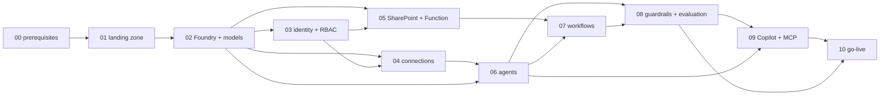

# Implementation Series — Microsoft Foundry build-out of the InfoSec Assurance platform

Index of the eleven implementation steps (`series/00` … `series/10`) that take
the conversion kit in `convertion/` from a repository to a governed production
service for the Euronext (ENX) InfoSec Assurance team. Every step is written the
same way — objective, prerequisites, Foundry-portal and Azure-portal click-path,
the equivalent CLI/Bicep/kit-script commands, the values that land in
`setup/.env`, verification checks, rollback, ISMS evidence, sources — so a step
can be executed, verified and signed off independently, in each environment.

Platform facts are as of **2026-09-12** and carry their GA/preview status; the
kit files cited are real paths in this repository. Nothing in this folder edits
shared kit files: where a step needs a change to `README.md`, `REQUIREMENTS.md`,
`ARCHITECTURE.md`, `infra/main.bicep`, `deploy.sh`, `integrations/registry.json`,
`setup/.env.example` or the governance files, the literal text is returned as a
*shared delta* to the integration pass, and the step says so.

Invariants no step may relax (from `governance/`): agents hold **read-only**
tools; every write of record passes the **output-verifier and a human
approval**; the **owner reviews every platform update** before it reaches
users; all processing stays in the **EU** (`DataZoneStandard`, EU region); no
Euronext data in web-search queries.

## 1. Accountability

| Role | Who | In this series |
|---|---|---|
| Accountable owner (creation, planning, maintenance, optimisation, updates) | Francisco Gustavo Gomes `{upn:francisco.gomes}` | Owns every step; executes steps 02, 04–10; signs every gate |
| Assurance users | José Mogollon `{upn:jose.mogollon}`, Pedro Santos `{upn:pedro.santos}`, José Meireles `{upn:jose.meireles}`, Tânia Morais `{upn:tania.morais}` | UAT in `test` (steps 06–09), hypercare feedback (step 10); one of them is the nominated deputy (`team/ACCESS_REGISTER.md`) |
| Azure landing-zone team + Entra IAM team | `{group:azure-platform}`, `{group:iam-admins}` | Execute steps 01 and 03 with the owner; countersign their gates |
| M365 / SharePoint admins | `{group:spo-admins}`, `{group:m365-admins}` | Steps 05 and 09 (Sites.Selected grants, app publication approval) |
| Target-system custodians | `{group:jira-admins}`, `{group:onetrust-admins}`, `{group:enx-gateway}`, `{upn:iaf-owner}`, Confluence / SecurityScorecard / Azure DevOps admins | Step 04 (read-only service accounts, tokens, consent) |
| Line manager / CISO delegate | `{upn:line-manager}` | Countersigns steps 03 and 10 (privileged groups, go-live) |
| DPO | `{group:dpo}` | Consulted at steps 04 and 08 (RoPA, Purview, memory) |

## 2. Environment strategy — dev / test / prod

| | `dev` | `test` (UAT) | `prod` |
|---|---|---|---|
| Resource group | `rg-infosec-foundry-dev` | `rg-infosec-foundry-test` | `rg-infosec-foundry` |
| Parameter file | `infra/main.parameters.json` (`environmentName: dev`) | `infra/main.parameters.test.json` — **to be added** (shared delta S-01): copy of the prod file with `baseName` `infosecfdrytst`, `environmentName` `test`, budget 500 | `infra/main.parameters.prod.json` |
| Network | public endpoint, no VNet | private endpoints + agent VNet, public access `Disabled` — identical to prod | private endpoints + agent VNet, public access `Disabled` |
| Models | same three tiers, `DataZoneStandard`, lower capacity (10/10/20 K TPM) | prod capacities | as `main.parameters.prod.json` |
| Connections (`conn-*`) | none — `attach_integrations.py --dry-run` only | read-only service accounts against **test tenants** where the custodian has one (Jira/Confluence sandbox, OneTrust test); otherwise the prod read-only account, approved by owner + custodian per connection (`team/ACCESS_REGISTER.md` row marked `test`) | prod read-only accounts |
| SharePoint | none (Function deployed with `SHAREPOINT_SITE_ID` unset → `/upload` disabled) | dedicated test site `{sharepoint:infosec-assurance-test}` | `{sharepoint:infosec-assurance}` |
| Data | synthetic / public inputs (`Governance/ComparisonSet/inputs/`) | the comparison set of `operations/CHANGE_MANAGEMENT.md` §4 (known assessments already stored on the prod site, copied by the owner) | Euronext data |
| Users | owner | owner + the four users (UAT) | the five |
| Purpose | SDK/runtime work, Bicep what-if, script dry-runs, first agent creation | full pipeline runs to SharePoint, approval flow, Copilot/MCP surfaces, evaluation baseline, DR test | the service |

Promotion rule: one git tag moves `dev → test → prod`; a step is executed
per environment in that order, and `prod` may only receive a commit that
passed the same step's gate in `test`. Same Bicep, same scripts, different
parameters (`operations/LIFECYCLE.md` §7). `environmentName` in
`infra/main.bicep` currently allows only `dev|prod`; adding `test` is shared
delta S-01.

## 3. The steps — owner, effort, dependencies

Effort = elapsed working days for the named executors, per environment
(prod figures; dev/test are usually shorter because connections and
approvals are lighter). Waiting time for custodians and consents is not
counted — start step 04's requests during step 01.

| # | Step | Executes (R) | Effort (days) | Depends on | Gate countersign |
|---|---|---|---|---|---|
| 00 | [Prerequisites](series/00-prerequisites.md) — subscriptions, tooling, decisions of record, request queue | owner | 2 | — | — |
| 01 | [Landing zone and network](series/01-landing-zone-and-network.md) — RG, VNet, agent subnet, private DNS, Azure Policy | landing-zone team + owner | 3 | 00 | `{group:azure-platform}` |
| 02 | [Foundry account, project, models](series/02-foundry-account-project-models.md) — `main.bicep` deployment, capability host decision, three tiers, RAI policy | owner | 2 | 01 | — |
| 03 | [Identity, groups, RBAC](series/03-identity-groups-rbac.md) — `sg-infosec-foundry-*`, PIM, Conditional Access, `team/rbac.bicep`, agent identities | IAM team + owner | 3 | 02 | `{upn:line-manager}` |
| 04 | [Connections and integrations](series/04-connections-and-integrations.md) — every `conn-*`, app permissions and admin consents, service accounts, Key Vault secrets | owner + custodians | 5 (+ waiting) | 02, 03 | each custodian |
| 05 | [SharePoint and delivery Function](series/05-sharepoint-and-delivery-function.md) — site taxonomy, `Sites.Selected`, Function image, renderers | owner + SPO admins | 3 | 02, 03 | `{group:spo-admins}` |
| 06 | [Agents — conversion and deploy](series/06-agents-conversion-and-deploy.md) — runtime migration to the Responses API, `deploy.sh`, verifier, orchestrator | owner | 6 | 02, 04 | — |
| 07 | [Workflows — Logic Apps](series/07-workflows-logic-apps.md) — 12 pipeline instances + routines, approval flow, Key Vault app settings | owner | 4 | 05, 06 | — |
| 08 | [Guardrails, observability, evaluation](series/08-guardrails-observability-evaluation.md) — RAI per deployment, Prompt Shields, tracing, alerts, evaluation baseline, Defender/Purview | owner (+ DPO consulted) | 3 | 06, 07 | `{group:dpo}` (RoPA) |
| 09 | [Copilot, MCP, user surfaces](series/09-copilot-mcp-user-surfaces.md) — Teams/M365 Copilot publication, MCP server, quickstart | owner + M365 admins | 3 | 06, 08 | `{group:m365-admins}` |
| 10 | [Go-live, hypercare, operations](series/10-go-live-hypercare-operations.md) — access provisioning, cut-over, 4-week hypercare, hand-over to `operations/` | owner + users | 2 + 20 hypercare | 01–09 | `{upn:line-manager}` |

Dependency graph (arrows = "needs the gate of"):



Critical path: 00 → 01 → 02 → 03 → 04 → 06 → 07 → 08 → 09 → 10
(≈ 33 working days per environment excluding custodian waiting time and
hypercare). Steps 03/05 and 04, and 08/09, can run in parallel where the
executors differ.

## 4. Gate rule — how a step is closed

A step is **done in an environment** only when all four hold:

1. **Verification checks** — every row of the step's *Verification* table
   passes; the command output or screenshot is filed at
   `Governance/Implementation/{env}/{NN}/` on the InfoSec Assurance site
   (the folder convention of `operations/RUNBOOK.md` §2 and
   `operations/access-governance/QUARTERLY_ACCESS_REVIEW.md`).
2. **Owner sign-off** — `{upn:francisco.gomes}` records
   `Governance/Implementation/{env}/{NN}/sign-off.md` (template below).
3. **Countersign** where the table above names one (landing zone, line
   manager, custodian, SPO/M365 admins, DPO). The owner cannot countersign
   his own gate — the same segregation line as `team/README.md` §3.
4. **No open Sev-1/2 finding** from the step's checks; a Sev-3 may be
   carried as a dated action in the sign-off.

A failed check keeps the step open; the *Rollback* row of the step says
how to return to the previous state. Re-running a step is always
idempotent by design (`deploy.sh` is idempotent by agent name; Bicep is
declarative; `provision_identity.sh --apply` only creates what is missing).

```markdown
# Sign-off — step {NN} {title} — {env}
Commit / tag: {tag}   Executed by: {upn}   Date: {yyyy-mm-dd}
Checks: {n}/{n} passed (evidence files listed below)
Open findings: none | {id} (Sev-3, due {date})
Deviations from the step text: none | {description + reason}
Owner sign-off: {upn:francisco.gomes} {date}
Countersign: {role} {upn} {date}
```

## 5. Cross-cutting platform changes surfaced by the research (decisions of record)

These change how several steps are executed; each is decided in step 00
and applied where noted.

| # | Finding (status, 2026-09-12) | Consequence for the kit | Applied in |
|---|---|---|---|
| D1 | The classic Foundry Agent Service (threads/runs, `azure-ai-agents` `AgentsClient`) is deprecated and **retires 2027-03-31**; the Azure OpenAI Assistants API it was built on **retired 2026-08-26**. The GA service uses agents / conversations / responses (Responses API) and `azure-ai-projects` 2.x — [GA] https://learn.microsoft.com/en-us/azure/foundry/agents/how-to/migrate (2026-08-05); https://learn.microsoft.com/en-za/answers/questions/5934023/ (2026-07-22) | A new deployment must **not** be built on the classic runtime. Scripts, MCP server and every Logic App HTTP action are migrated **before** the first agent is created (step 06 §A, step 07 §A). `setup/requirements.txt` moves to `azure-ai-projects>=2.3.0,<3` and drops `azure-ai-agents` (shared delta S-06) | 06, 07 |
| D2 | **Connected agents are not available** in the new service (replacement: A2A tool, public preview; or Microsoft Agent Framework 1.0, GA) — [GA/preview] https://learn.microsoft.com/en-us/azure/foundry/agents/how-to/migrate#agent-tool-availability (2026-08-05); https://learn.microsoft.com/en-us/azure/foundry/agents/how-to/tools/agent-to-agent (2026-09-04) | The orchestrator / `enx-tprm-control-center` routing is re-implemented: v1 = deterministic routing through `workflows/agent-fanout.json` and explicit agent selection; A2A tool piloted in `test` only | 06 §D, 07 |
| D3 | **`o3-mini` does not support the OpenAPI, MCP, Azure AI Search, SharePoint or Web Search tools**; `gpt-4o-mini` lacks Azure AI Search — [GA] https://learn.microsoft.com/en-us/azure/foundry/agents/concepts/limits-quotas-regions#tool-support-by-region-and-model (2026-09-07) | The kit's original `reasoning` tier (`o3-mini`) could not carry the advisory read-only toolset. **Resolved 2026-09-12:** the reasoning deployment of record is `o4-mini` (alternate `gpt-5-mini`, then `gpt-4.1`) — in the EU Data Zone list and marked supported for OpenAPI + MCP + Web Search. Confirm the tool columns at execution time and record the row in the step-02 sign-off; `attach_integrations.py` and `verify_kit.py` fail the run if a tier model cannot carry an agent's tools | 02 §C |
| D4 | Model retirements: `gpt-4o 2024-11-20` Legacy, retires **2027-04-14** (replacement `gpt-5.1`); `gpt-4o-mini 2024-07-18` Deprecated, retires **2027-04-14** — [GA] https://learn.microsoft.com/en-us/azure/foundry/openai/concepts/model-retirement-schedule (2026-09-02) | Pinned versions stay for go-live (comparison set validated on them); `versionUpgradeOption: NoAutoUpgrade`; a replacement-model project is scheduled for Q1 2027 using the six-phase migration process | 02, 10 |
| D5 | **1 vector store per agent** (and per conversation) is a fixed limit of the new file-search tool — [GA] https://learn.microsoft.com/en-us/azure/foundry/agents/concepts/limits-quotas-regions (2026-09-07) | The advisor cannot attach `vs-assurance-combined` **and** `vs-assurance-memory`; memory notes are folded into one store (v1) or served through an Azure AI Search index (Foundry IQ path, `enterprise/memory-learning/`) | 06 §C |
| D6 | Standard agent setup (customer-owned Cosmos DB, Storage, AI Search) keeps conversations, files and vector stores in the tenant; the **capability host cannot be changed after creation** — [GA] https://learn.microsoft.com/en-us/azure/foundry/agents/concepts/standard-agent-setup (2026-07-09) | Decide basic vs standard setup **before** the first agent exists. Recommended: standard setup in `test`/`prod` (DORA evidence and residency), basic in `dev` | 02 §B |
| D7 | Network-secured agents need a **subnet delegated to `Microsoft.App/environments`** (/27 minimum, /24 recommended), injected at creation, Foundry resource in the same region as the VNet; a managed VNet is the GA alternative — [GA] https://learn.microsoft.com/en-us/azure/foundry/agents/concepts/networking-options (2026-09-09); https://learn.microsoft.com/en-us/azure/foundry/how-to/managed-virtual-network (2026-08-18) | `infra/network.bicep` gains an `agents` subnet (shared delta S-02); tools under isolation are checked in step 08 | 01, 02 |
| D8 | Built-in role names changed (`Azure AI User` → `Foundry User`, `Azure AI Developer`/`Owner` → `Foundry …`); GUIDs are listed on the RBAC page — [GA] https://learn.microsoft.com/en-us/azure/foundry/concepts/rbac-foundry (2026-09-10) | `team/rbac.bicep` assigns by GUID (verify each GUID against the RBAC page at step 03 — Foundry User keeps `53ca6127…`); portal and docs show the new names; `setup/provision.sh`'s `--role 'Azure AI User'` line is updated (shared delta S-03) | 03 |
| D9 | MCP tool GA with `require_approval` (default `always`), `allowed_tools`, auth through a **project connection**; OpenAPI tool GA with anonymous / API-key (custom-keys connection) / **project managed identity** auth — [GA] https://learn.microsoft.com/en-us/azure/foundry/agents/how-to/tools/model-context-protocol (2026-08-26); https://learn.microsoft.com/en-us/azure/foundry/agents/how-to/tools/openapi (2026-08-21) | Graph-backed specs authenticate with the **project managed identity** (no secret); Basic/Token specs become custom-keys connections; the ENX gateway bearer moves from run-time headers into a connection | 04 |
| D10 | Grounding with Bing Search / Web Search: data leaves the Azure compliance boundary and the Data Protection Addendum does not apply — [GA] https://learn.microsoft.com/en-us/azure/foundry/agents/how-to/tools/bing-tools (2026-08-27) | Kit position unchanged (sanitised public queries only, detective KQL alert); risk acceptance recorded by the owner in step 08; Bing Custom Search (preview) domain allow-list evaluated in `test` | 04, 08 |
| D11 | Publishing a Foundry agent to Teams / Microsoft 365 Copilot is a native GA flow (Azure Bot Service resource, M365 admin approval; no streaming/citations/file upload in M365 Copilot; `enable_m365_public_endpoint` for private projects) — [GA] https://learn.microsoft.com/en-us/azure/foundry/agents/how-to/publish-copilot (2026-08-26) | Replaces `integrations/copilot/README.md` Option 1 for the conversational advisors; report requests keep the Logic Apps path | 09 |
| D12 | Foundry portal *workflows* (visual designer) retire **2026-12-01** — [preview] https://devblogs.microsoft.com/agent-framework/microsoft-agent-framework-version-1-0/ (2026-04-03; retirement page 2026-07-31) | Not used anywhere in the series | — |

## 6. Shared deltas produced by this series

Every step lists its own; the integration pass applies them. Identifiers
`S-nn` are referenced from the steps.

| Id | File | Change (summary — literal text in the step) |
|---|---|---|
| S-01 | `infra/main.bicep`, new `infra/main.parameters.test.json` | add `test` to `environmentName` allowed values; test parameter file |
| S-02 | `infra/network.bicep`, `infra/main.bicep` | `agents` subnet delegated to `Microsoft.App/environments` (/24) + network-injection parameters; standard-setup resources behind `enableStandardAgentSetup` |
| S-03 | `setup/provision.sh` | role name `Foundry User` in the printed hint |
| S-04 | `setup/.env.example` | `FOUNDRY_API_VERSION=v1`, `AGENT_SETUP=basic|standard`, `SHAREPOINT_ADVISORY_ROOT_ITEM_ID`, group object ids, `APPROVAL_ROUTING_PATH` |
| S-05 | `integrations/registry.json` | `auth` field per connection (`managed_identity` / `custom_keys` / `none`), `foundry_connection: null` for Graph specs |
| S-06 | `setup/requirements.txt`, `mcp-server/requirements.txt` | `azure-ai-projects>=2.3.0,<3`; remove `azure-ai-agents` |
| S-07 | `workflows/pipelines.json`, `workflows/*.json` | `apiVersion` default `v1`; HTTP actions on `/openai/v1/conversations` + `/openai/v1/responses` |
| S-08 | `governance/HUMAN_APPROVAL.md`, `governance/DATA_PROTECTION_GUARDRAILS.md` | cross-links to `enterprise/series/08` (guardrail register, Bing risk acceptance, continuous-evaluation sampling) |
| S-09 | `README.md`, `REQUIREMENTS.md`, `ARCHITECTURE.md` | "Implementation" pointer to this series; runtime wording threads → conversations; connected agents → routing note |
| S-10 | `deploy.sh` | step `[0/7] runtime pre-flight` (SDK major check) before conversion |
| S-11 | new `functions/delivery/Dockerfile` | container image the existing `infra/delivery.bicep` expects (step 05 G-05) |
| S-12 | new `scripts/build_logicapps.py` (+ `ci/deploy_logicapps.sh`) | instance generator referenced by `workflows/README.md` but absent (step 07 G-07) |
| S-13 | `workflows/README.md` | rule for the Logic Apps Agent action (preview): read-side orchestration only, no write connector as an agent tool (step 07 §3) |
| S-14 | new `operations/evaluation/run_evals.py`, `EVALUATION.md` | evaluation harness referenced by `operations/TOKEN_ECONOMY_PLAYBOOK.md` but absent (step 08 G-08) |
| S-15 | `scripts/attach_integrations.py` | implement the `--list-mcp-tools` flag and the `readOnlyHint` check that `integrations/mcp/enx-gateway.json` already documents (step 04 G-04) |

## 7. Files in this folder

| File | Content |
|---|---|
| `IMPLEMENTATION_SERIES.md` | this index |
| `series/00-prerequisites.md` … `series/10-go-live-hypercare-operations.md` | the steps |
| `../memory-learning/MEMORY_LEARNING_RESEARCH.md` | sibling research note (memory tiers, Foundry IQ, evaluation loop) referenced by steps 06 and 08 |
